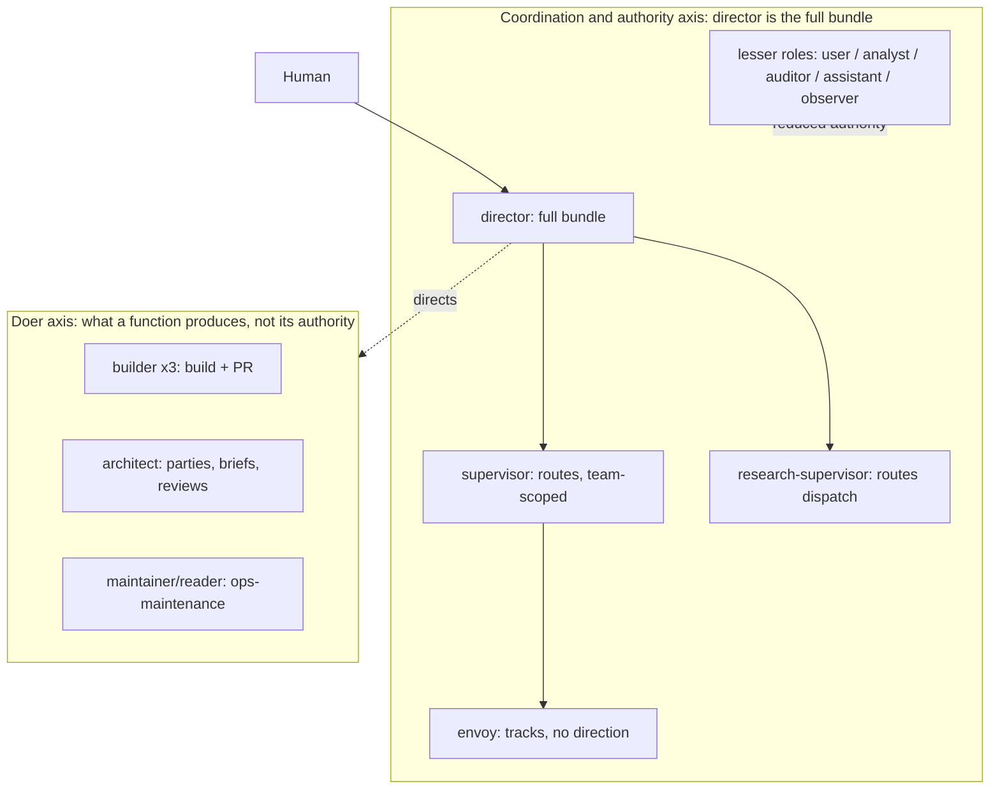
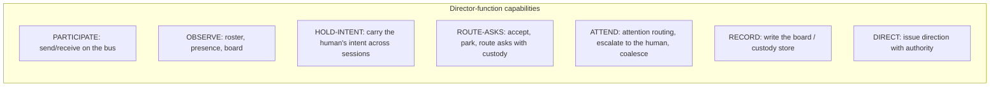
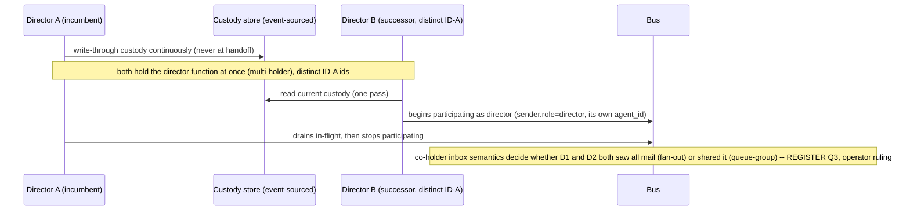

# Director as a function: a function block diagram over the nine fleet functions

Status: FBD, held for the operator. Carries its open questions as a register and flags the
items that want an operator ruling rather than deciding them, per the operator's instruction.
Built on the director-as-a-function reframe (`director-function-model-analysis-2026-09-18.md`)
and the minimal grant (`minimal-director-function-grant-2026-09-18.md`). Date: 2026-09-18. In
the shape of the NATS-topology FBD (a block diagram plus sequence and transaction views plus a
carried register). Redaction held: no origin organization, its short environment tokens, its
infrastructure repository, or the deployed hub hostname.

## The one idea the diagram carries

Director is a FUNCTION: a bundle of capabilities on the bus. A participant HOLDS the function
through a launcher-set grant (`sender.role` backed by ID-A), and more than one participant may
hold it. The lesser roles the operator named (user, analyst, auditor, assistant) are the same
function with a REDUCED capability set, so they are one taxonomy on one axis, not a separate
design. This axis is COORDINATION AND AUTHORITY. It is distinct from the DOER axis (build,
author, maintain), which is what a function DOES, not what direction authority it carries.

## Block level 1: the two axes



The nine fleet functions split across the two axes. The director, supervisor, envoy, and
research-supervisor are AUTHORITY-axis functions (coordination, with decreasing authority). The
three builders, the architect, and the maintainer are DOER-axis functions (they hold work
capabilities, and they receive direction; they do not carry direction authority). The lesser
roles the operator named live on the AUTHORITY axis, below director, as reduced-authority
holders. This split is the reason the single seat was the wrong model: it collapsed the whole
authority axis into one exclusive holder.

## Block level 2: the capability decomposition of the director function

A candidate decomposition. Granularity is an open question (register Q1), so read these as the
shape, not the final list.



`PARTICIPATE` is the base every bus role needs, and it is exactly what a `plan`-mode cast
denies (the brief-7 / skippy defect: a routing role cast at `plan` cannot send). So the grant
that makes a role a bus participant is load-bearing for every AUTHORITY-axis role, not only the
director.

## Block level 3: roles as capability bundles (a candidate taxonomy)

Membership is an open question (register Q5). This is the shape the operator's lesser-roles list
implies, drawn as subsets of the director bundle.

| Role | PARTICIPATE | OBSERVE | HOLD-INTENT | ROUTE-ASKS | ATTEND | RECORD | DIRECT |
|---|---|---|---|---|---|---|---|
| director | yes | yes | yes | yes | yes | yes (board) | yes (fleet) |
| supervisor | yes | yes | no | yes | no | no | team-scoped |
| research-supervisor | yes | yes | no | dispatch | no | no | dispatch-scoped |
| envoy | yes | yes | no | track-only | no | track-record | no |
| assistant | yes | yes | draft-only | no | no | no | no |
| analyst | yes | yes | no | no | no | findings-record | no |
| auditor | yes | read-all | no | no | no | audit-record | no |
| user | yes | yes | no | no | no | no | no |
| observer | receive-only | yes | no | no | no | no | no |

Every non-director row is a SUBSET or a SCOPED version of the director row. That is the whole
claim: the taxonomy is subsets on one axis, and the grant (`sender.role`) names which bundle a
participant holds. A receiver verifies a message against the bundle the role carries, not
against a single seat.

## Sequence view: a directed action under the function model

```mermaid
sequenceDiagram
  participant H as Human
  participant L as Launcher
  participant D as Director session (holds director fn)
  participant B as Bus
  participant W as Worker session
  H->>L: launch director with DIRECTOR_GLOBAL_ROLE=director, DIRECTOR_AGENT_ID=<id-a>
  L->>D: env-set grant (out of band); --strict-mcp-config
  D->>B: send, envelope carries sender.role=director, sender.agent_id=<id-a>
  B->>W: deliver
  W->>W: read sender.role; trust it (there are no peers; presence shows a live director)
  W-->>D: act on the direction
  Note over W: no content asserts authority; the grant is the launcher-set role, not the message body
```

## Transaction view: co-holding and a graceful handoff, no vacancy

The single seat made a handoff a knife-edge (acquire, vacate). The function model makes it a
transaction two holders both satisfy, because custody is externalized (continuous-custody).



The transaction never requires a moment where no one holds the function, and it never requires
one exclusive holder. Where a specific capability DOES need one live writer (the board pen), a
per-capability lease sits under that one capability (register Q2), not under the whole role.

## The open-questions register (carried, not resolved)

Flagged [OPERATOR RULING] where the operator's judgment is wanted rather than a design answer.

- **Q1. Capability granularity.** What is the atomic capability set, and how fine? The level-2
  list is a candidate. Too fine is unusable; too coarse loses the lesser roles. Design question,
  wants a probe against real use.
- **Q2. Which capabilities need per-capability exclusivity [OPERATOR RULING].** Some capabilities
  want exactly one live writer (the board pen, the commit pen for a resource, a single decision
  authority at a moment); most are safely multi-held. Which ones are exclusive is a judgment
  about how the operator wants direction to work, and it decides where the fenced lease survives
  as a tool. The operator named this as wanting a ruling.
- **Q3. Co-holder inbox semantics [OPERATOR RULING].** Two director-holders each bind their own
  per-session durable on `global.director.inbox`, so today each sees ALL director mail (fan-out).
  Fan-out (both see everything and coordinate) versus a shared queue-group (one delivery,
  load-shared) is a per-function policy. Moot until a second holder exists, so it does not block
  the crossing, but it is the first thing the second holder forces.
- **Q4. Two human directors: authority reconciliation [OPERATOR RULING].** Two humans each
  directing: is authority partitioned by workspace, team, or principal, or is there a shared
  authority both hold, and how do their directions reconcile if they conflict? The operator named
  this as wanting a ruling. It is a governance question, not a mechanism one.
- **Q5. Taxonomy membership.** The initial role set (director, supervisor, research-supervisor,
  envoy, assistant, analyst, auditor, user, observer) and its alignment with the wardrobe role
  library and the nine fleet functions. Should be reconciled with wardrobe, not invented twice.
- **Q6. Grant representation across phases.** The physical-access grant is the launcher-set
  `sender.role` backed by ID-A (already coded). The crypto-phase grant is a signed capability in
  `sender.principal` (RESERVED slot). The step between (a lightweight KV grant record for
  verify-not-trust and revocation) is named but not scheduled; it returns when a lesser role
  needs enforcement or revocation, not before.
- **Q7. Doer-axis relationship.** The builders, architect, and maintainer receive direction and
  hold work capabilities; they are not director-subsets. Confirm the two axes stay separate in
  the wardrobe casts (a builder is a doer with `PARTICIPATE` + build capabilities, not a
  reduced-authority director).
- **Q8. R-94 enforcement, and the worker-upward intent [one part is an OPERATOR RULING]
  (finding-179, aae-orc#361).** skippy's P2.2 test showed R-94 is not enforced at the broker
  (per-team grants, so role is not a security boundary inside a team). This confirms the grant
  spec's stated limit: `sender.role` is a label trusted by the boundary, not a broker-enforced
  attestation. My read, folded into the model: R-94 governs holding a global ADDRESS, not
  sending; SUBSCRIBE should narrow to the role's own inbox (closes the read leak), PUBLISH stays
  open (send is not the boundary); role-as-enforced (per-role broker grant, or the Q6 KV grant
  record) is the enforcement axis. The one operator ruling inside this: whether a direct
  worker-to-director ESCALATION path is wanted (bypassing the supervisor), because the two-tier
  model (R-86) otherwise routes upward reports worker to supervisor (local) to director (global),
  and a direct worker-to-director publish reads as leakage rather than a supported path. This is
  now framed against skippy's recommended shape (#355) in the R-94 section of
  `director-function-model-analysis-2026-09-18.md`: default two-tier, with the direct path kept
  OPEN but rare and audited for the dead-supervisor last-resort case only. If kept open, "rare and
  audited" requires an audit trail (the bypass is a logged escalation event) and a
  supervisor-liveness precondition (the R-92 liveness check gates it: admitted only when the
  worker's supervisor has no live presence row). The operator's call is keep-open-but-constrained
  versus close, not keep-versus-close in the abstract. marvel-builder is assessing the
  broker-grant per-role rendering fix in parallel.

## What this FBD does not do

It does not fix the capability set, does not settle the taxonomy membership, and does not
resolve the four rulings above. It gives the block structure (two axes, capability
decomposition, roles as subsets), the sequence and transaction the grant supports, and the
register, so the operator can rule on the flagged items and the design can proceed on the rest.
