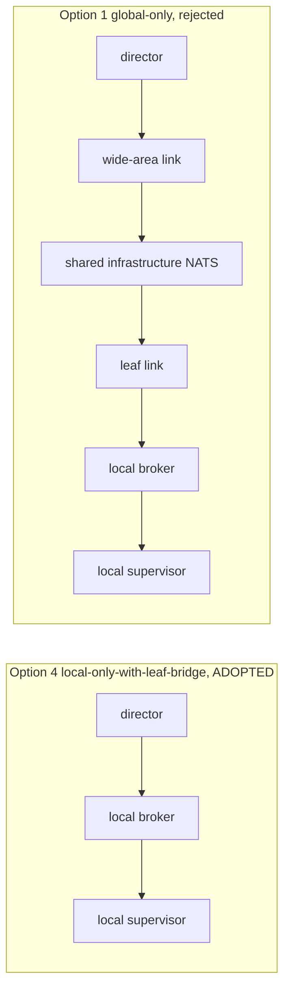
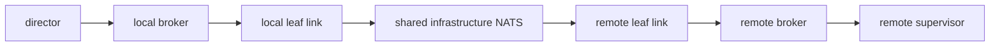
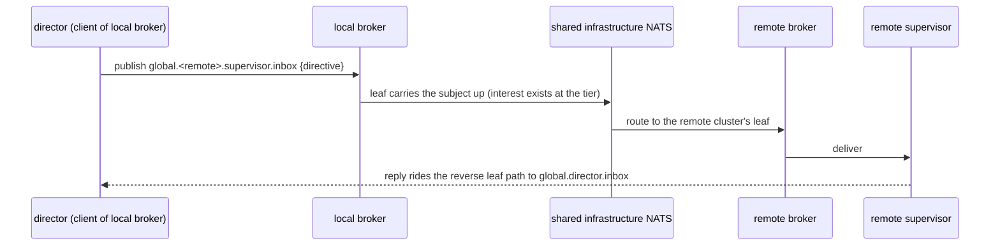

# Director NATS attachment topology: recommendation

Status: the operator has RULED for the leaf-attach direction. This doc now
frames how to make that direction clean; the design views are held for the
operator, nothing committed to a design doc.
Date: 2026-09-17 (party), reframed on the operator's ruling.
Redaction: the durable global tier is named only "the shared infrastructure
NATS" throughout.

## The operator's ruling

The operator has ruled for leaf-attach: migrate the local cluster's bus to
marvel-managed auth so a SINGLE director connection reaches local and global.
That is exactly what this party converged on independently. In the party's
terms it is option 4, local-only-with-leaf-bridge: the director holds one
connection, to its own local broker, and the leaf carries global and
cross-cluster reach. So the recommendation below is not a choice still open; it
is the ruled direction, and the rest of this doc is about making it clean. The
alternatives (tandem, migrate, global-only) are settled as not-chosen and kept
only as an appendix for the record.

Two pieces make the ruled direction concrete:

- The director attaches to its own local broker and nothing else. Its
  connection code is identical across every deployment shape; only the local
  broker's leaf config varies.
- The local cluster's bus moves to marvel-managed auth: the local broker's leaf
  presents an enrolled leaf credential to the shared infrastructure NATS
  (the enrollment path and bd `aae-orc-ct0l4` already own this), so one director
  connection reaches local and global without the director holding a second
  connection or any tier credential of its own.

## What "make it clean" means (the checklist)

1. The director connects only to its local broker, with unlimited reconnect so a
   local patch does not strand it (client config below).
2. The local broker leafs up with a marvel-managed, enrolled leaf credential; the
   director carries no tier credential.
3. The director keeps its global ADDRESS (its identity and subject at the tier)
   while holding only a local ATTACHMENT; the two are separate, and the design
   docs should stop conflating them (revisions below).
4. The director's global INBOUND rides a local mirror of its inbound stream, so
   inbound survives a leaf outage and reconciles on return (the one design
   consequence to confirm, below).
5. Outbound cross-cluster request and reply rides the leaf live and fails loud
   (no-responders 503) during a partition, which the director handles like any
   unreachable peer.

## The question the party answered

The design doc `sim/design/global-nats-leaf-attach.md` (commit d41a292) shows
the director talking to the global tier directly (Mode A: `dir -->|global
address| gt`). The most common real configuration is one director plus one
local marvel plus no global tier at all. That mismatch raised four questions:

1. Should the director hold TANDEM local and global connections at once?
2. Should the director MIGRATE its attachment point between local and global,
   and when?
3. What does connecting to the global tier buy, weighed against the operator's
   two failure framings:
   - a global-only director loses its own LOCAL marvel cluster on any internet
     interruption;
   - a patch or restart of the LOCAL nats stops a local-only director's reach
     to REMOTE clusters.
4. Can a NATS CLIENT be attached to the fabric at two or more points at once,
   and what does that cost?

## The design, restated

The ruled design is local-only-with-leaf-bridge for every deployment shape. The
director connects as a client to the broker on its own host, and to nothing
else. When a global tier exists, that local broker is a leaf of the shared
infrastructure NATS, and the leaf carries the director's global and
cross-cluster traffic. When no global tier exists, the director loses nothing,
because it was never attached to a tier.

The director's connection code is identical across every deployment shape. The
only thing that varies is the local broker's `leafnodes.remotes` config, which
is a deploy-time fact, not director logic.

The party reached this unanimously across five independent researchers
(architecture, NATS internals, platform ops, failure analysis, availability),
each of whom web-verified against the NATS documentation before positioning.

### Why, in one line each

- The peer the director must never lose is its own supervisor, one hop away on
  the local broker. Attach where that peer is closest, so no wide-area hop sits
  in the path that must not break.
- A single NATS connection is one ordering domain, one reconnect state machine,
  one automatic resubscribe. The leaf does the cross-tier work for free that
  tandem and migrate try to hand-roll at the client.
- Global reach is a property of the leaf link, not of a second director
  connection. Adding a global tier changes the local broker's config, not the
  director.

## The load-bearing technical answer (question 4)

A NATS client attaches to ONE server at a time. It is configured with a server
pool (a list of URLs), tries them until one answers, and on a drop it
reconnects to a server from that pool. That is failover at connect and
reconnect time, not simultaneous attachment to two points. On reconnect the
client replays its handshake and re-sends every subscription automatically;
publishes issued while reconnecting sit in a bounded client buffer (8 MB
default in Go and Java) and flush in order once the socket returns.

So "attached at two points at once" can only mean one of two things:

- (a) TWO SEPARATE client connections from one process. This is the tandem
  option. Core NATS delivers one copy per active subscription, with no notion
  of client identity that would collapse two subscriptions into one delivery.
  Any subject both connections subscribe to (and a leaf link will bridge that
  interest) yields two deliveries on every publish, continuously, not only
  during a fault. There is no cross-connection dedup and no cross-connection
  ordering. A shared queue group collapses the duplicate to one delivery, but
  it is an explicit opt-in both connections must join, and it adds its own
  bookkeeping.
- (b) ONE connection, relying on the SERVER-SIDE FABRIC (leaf or gateway) to
  route. This is exactly option 4. Interest the director registers on its local
  broker propagates up the leaf automatically, so a director attached only to
  its local broker is reachable from the global tier and from other clusters
  without a second connection. Queue groups and JetStream both prefer a local
  member and cross the leaf or gateway only when no local member exists, so the
  fabric routes efficiently on the director's behalf.

The client cannot itself "move" while staying attached; a move is a
disconnect-then-reconnect, which is what makes option 3 (migrate) a state
machine whose only job is deciding where to be, at the cost of a full
resubscribe on every move.

## Appendix: why the alternatives were set aside (settled, for the record)

These are no longer open; the operator has ruled for leaf-attach. The table is
kept so the reasoning behind setting the other three aside is on the record.

| Option | Verdict | Core reason |
|---|---|---|
| 4. local-only-with-leaf-bridge | ADOPT | One connection; the leaf carries global reach for free; no wide-area hop in the local-supervisor path; identical in the no-global and global-present cases. |
| 2. tandem | REJECT (inadvisable) | Structural steady-state duplicate delivery on any overlapping subject; no native dedup or ordering across two connections; the queue-group fix and a single-presence-owner rule are machinery the leaf makes unnecessary. |
| 3. migrate | REJECT | Every move is a disconnect and full resubscribe; the cutover window drops core-NATS messages addressed to the abandoned endpoint or sent before the new subscriptions exist; a local restart can flap the attachment point. |
| 1. global-only | REJECT (disqualified) | Nothing to dial in the modal no-global case; in the global-present case it routes the director-to-its-own-supervisor path through the wide-area link and the tier, so a home-internet blip severs local coordination one LAN hop away. This is the operator's first failure framing, and it is structural to the design. |

### The tandem question, resolved

Winston reserved tandem for an explicit service-level need: independent reach to
remote clusters when the director's own local leaf is partitioned. The NATS
internals ruling shows the cost of that reservation. Tandem is not a
low-cost fallback that only bites under partition; it duplicates delivery in the
steady state and needs an idempotency key plus a receiver dedup cache and a
single-presence-owner rule just to behave correctly when nothing is wrong. The
one thing tandem buys over option 4 is reach to remote clusters during the
narrow window where the local leaf link is down but the director's host still
has wide-area connectivity. If a future requirement ever makes that window
worth closing, the safer construction is a bounded, explicitly-scoped second
connection whose subject interest never overlaps the local connection's (so no
duplicate can form), opened for that purpose and torn down after, not a standing
tandem. That is an exception to design for later, not the default.

## Failure block diagram (reliability block view)

Each function is drawn as the series of components that all must be up for it to
work. Fewer blocks in series, and no wide-area block, is better for the function
that must not break.

Function: director reaches its OWN local supervisor.



Under option 4 the local-supervisor path is a two-block series (local broker,
then the supervisor) with no wide-area link anywhere in it, so a home-internet
outage and a global-tier outage both leave it untouched. Under option 1 the same
function passes through the wide-area link and the tier, so either outage breaks
it.

Function: director reaches a REMOTE supervisor. This function is wide-area by
nature for every option, because the peer is on another host.



Option 4 adds one local-broker block to this path versus a hypothetical direct
attach, which is the cost of never having a wide-area block in the local path.
That trade is correct: the local path is the one that must survive the common
outage, and the remote path is wide-area for everyone regardless.

Single points of failure, per function, option 4:

| Function | Blocks in series | Wide-area block present? |
|---|---|---|
| director to local supervisor | local broker | no |
| director to remote supervisor | local broker, local leaf, tier, remote leaf, remote broker | yes (unavoidable) |
| remote supervisor to director inbound | remote broker, remote leaf, tier, local leaf, local broker (director consumes locally, see mirror note) | yes (unavoidable) |

## Sequence views

### Common case 1: director directs its local supervisor (steady state)

```mermaid
sequenceDiagram
  participant D as director (client of local broker)
  participant LB as local broker
  participant S as local supervisor
  D->>LB: publish agent.<ws>.<team>.supervisor.inbox {directive, principal in envelope}
  LB->>S: deliver
  S->>LB: publish ack to reply subject
  LB->>D: deliver ack
  Note over D,S: no wide-area hop; unaffected by internet or tier state
```

### Common case 2: director directs a remote supervisor (steady state)



### Failure mode 1: home internet blips mid-work

```mermaid
sequenceDiagram
  participant D as director
  participant LB as local broker
  participant S as local supervisor
  participant G as shared infrastructure NATS
  Note over D,S: local directive and ack continue throughout, no wide-area hop
  LB-->>G: leaf link drops
  LB->>G: leaf retries (about 1 to 2 seconds)
  D->>D: a concurrent remote request returns no-responders (503), fails loud, not hung
  LB->>G: leaf relinks; JetStream mirror reconciles from its last sequence
```

### Failure mode 2: local nats restart or patch

```mermaid
sequenceDiagram
  participant D as director
  participant LB as local broker
  D-->>LB: connection drops, client enters RECONNECTING
  D->>D: publishes buffer in the client pending buffer (8 MB default), in order
  Note over D: MaxReconnects set to unlimited, so the client waits out a patch
  LB->>D: broker returns; client reconnects, replays subscriptions, flushes buffer in order
```

### Failure mode 3: global tier outage, internet up

```mermaid
sequenceDiagram
  participant D as director
  participant LB as local broker
  participant S as local supervisor
  participant G as shared infrastructure NATS
  Note over D,S: local direction and ack fully unaffected
  D->>D: remote requests return no-responders (503) until the tier returns
  LB->>G: leaf retries; mirror stalls at last sequence, reconciles on return
  Note over LB,G: loss only if isolation outlasts the tier stream's retention window
```

### Rejected-option sequences (shown to justify the rejection)

Migrate, cutover window:

```mermaid
sequenceDiagram
  participant D as director
  participant OLD as old attachment
  participant NEW as new attachment
  D-->>OLD: detach (subscriptions gone)
  D->>NEW: attach, resubscribe (takes a round trip)
  Note over OLD,NEW: a message addressed in this window lands on OLD (gone) or NEW (not yet subscribed); core NATS does not replay it
```

Tandem, steady-state duplication:

```mermaid
sequenceDiagram
  participant P as any publisher
  participant Llocal as local connection
  participant Lglobal as global connection
  P->>Llocal: message on a subject both connections subscribe
  P->>Lglobal: the same message, second independent delivery
  Note over Llocal,Lglobal: two deliveries per publish, every publish, not only under fault; needs dedup and a presence-owner rule to be correct
```

## Transaction views

A transaction here is one atomic control-plane exchange and its disposition
under normal and failed conditions, under the adopted option 4.

| Transaction | Normal | Internet blip | Local nats restart | Tier outage |
|---|---|---|---|---|
| Local directive plus ack (director to local supervisor) | completes locally | completes (no wide-area hop) | pauses; publishes buffer, resubscribe on return, then completes | completes (no wide-area hop) |
| Remote directive plus ack (director to remote supervisor) | completes over the leaf | fails loud (503) until relink, about 1 to 2 seconds | the director's local connection buffers; leaf independent; completes once both are up | fails loud (503) until the tier returns |
| Escalation inbound (remote supervisor to director) | delivered to the director's global inbox, consumed locally via a mirror | mirror stalls, reconciles on relink (no loss inside retention) | director reconnects and resumes consuming its local mirror | mirror stalls, reconciles on tier return; loss only past the retention window |

The escalation-inbound row is where the design implies one concrete mechanism:
see the mirror note below.

## What this implies for the design docs (revisions, held)

These are proposed edits, not applied.

1. `global-nats-leaf-attach.md`, Mode A. The diagram and prose show the director
   attached to the tier (`dir -->|global address| gt`). Revise to show the
   director attached to its LOCAL broker, with the local broker leafing up
   (`dir --- lb`, `lb -->|leaf| gt`). Draw the distinction the current doc
   conflates: a global ADDRESS is the director's identity and subject at the
   tier (`global://director/...`), which it keeps; a global ATTACHMENT is a
   transport connection to the tier, which the director does NOT hold in this
   design. The director holds a global address and a local attachment. R-86 and
   R-94 (only supervisor and director hold a global address; workers never do)
   stand unchanged; what changes is where the director's socket lands.

2. `global-nats-leaf-attach.md`, add a director-attachment section stating the
   rule: the director attaches to the broker on its own host, which is the local
   marvel broker in the common case; global and cross-cluster reach ride the
   leaf. The one edge is a director running on a host with no local broker at
   all, which is outside the modal shape and can attach to the nearest broker it
   coordinates; note it as an exception, not the default.

3. `global-bus-tier.md`, section 0. The hub provisions a `director` client user
   as a direct client of the tier. Reframe that user: it is the director's
   identity at the tier, realized through leaf-propagated interest and a local
   mirror of the director's inbound stream, not a standing direct socket from
   the director to the hub. A direct hub attachment remains valid only for a
   director co-resident on the hub host or as an explicit, documented exception.

4. The mirror note (new, and the one open design consequence to confirm). For
   the director's global INBOUND (remote supervisors messaging the director on
   `global.director.inbox`, stream `GLOBAL_TO_DIRECTOR`), option 4 implies
   mirroring that stream into the director's LOCAL broker JetStream domain, the
   same mirror pattern finding-004 already validated for hub streams on the leaf
   side, so the director consumes its inbound locally and the mirror reconciles
   across a leaf outage. Ephemeral core-NATS request and reply the director
   sends OUT to a remote supervisor rides the leaf live and fails loud on
   partition, which is the accepted behavior. This mirror is the concrete
   mechanism behind the escalation-inbound transaction row; it should be stated
   in the doc and confirmed against the existing mirror probe.

## Client configuration (adopted)

For the director's connection to its local broker (Go, nats.go):

```go
nats.Connect(localBrokerURL,
  nats.RetryOnFailedConnect(true),   // the first dial retries; the broker may be starting
  nats.MaxReconnects(-1),            // never give up on the local broker across a patch
  nats.ReconnectWait(2*time.Second), // nats.go default
  nats.ReconnectJitter(100*time.Millisecond, time.Second), // nats.go default
  nats.DisconnectErrHandler(func(_ *nats.Conn, err error) { /* log a local-broker bounce */ }),
  nats.ReconnectHandler(func(_ *nats.Conn) { /* log the return */ }),
  nats.ClosedHandler(func(_ *nats.Conn) { /* log a give-up, which should not happen with -1 */ }),
)
```

`MaxReconnects(-1)` matters: the nats.go default of 60 attempts at 2-second
spacing gives up in about two minutes, too short for "applying an update, back
in a bit" on a single-operator host. The handlers exist so a local-broker bounce
is logged rather than silently buffered into a queue nobody watches.

## Safety rules that survive the decision

Two rules the failure analysis named. Option 4 already satisfies both by
construction, so they are recorded as invariants to preserve, not new work:

1. Single presence-owner: exactly one connection is authoritative for "director
   is live" at any instant. Option 4 has one connection, so this holds trivially.
   Any future exception (a scoped second connection) must preserve it.
2. Idempotency key plus receiver dedup: required for any design with a dual
   attach. Option 4 has none, so it is not needed now; it is the precondition on
   any later tandem exception.

## What stays true from the current design

- The leaf topology, the two-role global-address rule (R-86, R-94), the A2A
  envelope, and authority-on-the-envelope (R-01, R-05) are unchanged. This
  recommendation is about the director's attachment point only.
- The leaf's detach tolerance and the JetStream mirror reconcile behavior
  (finding-004) are the foundation this leans on; nothing here reopens them.
