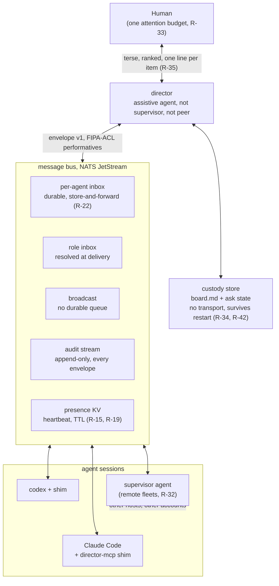
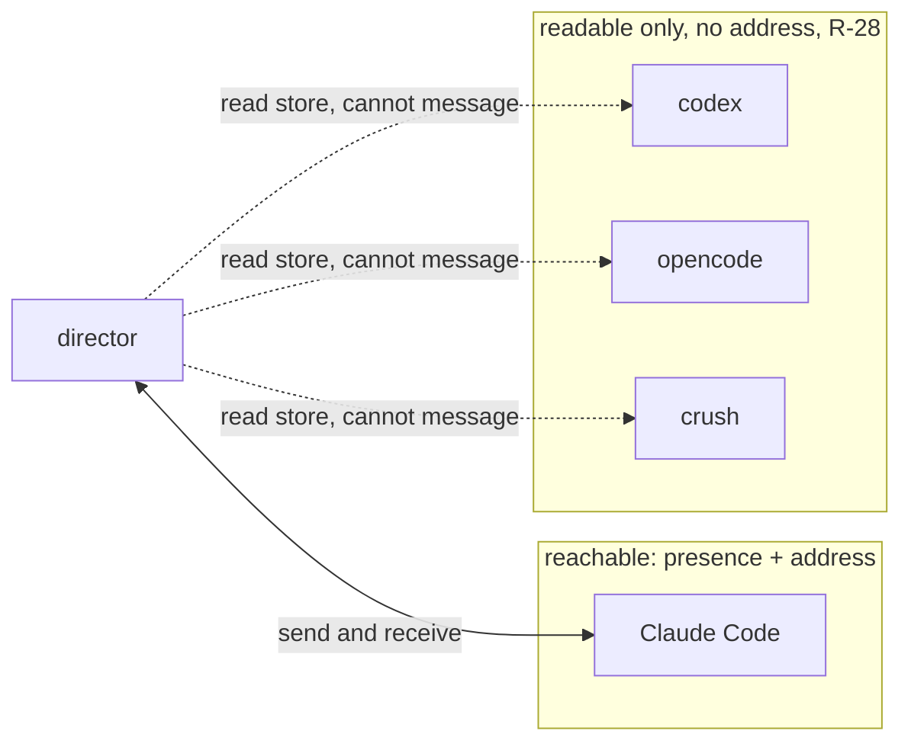
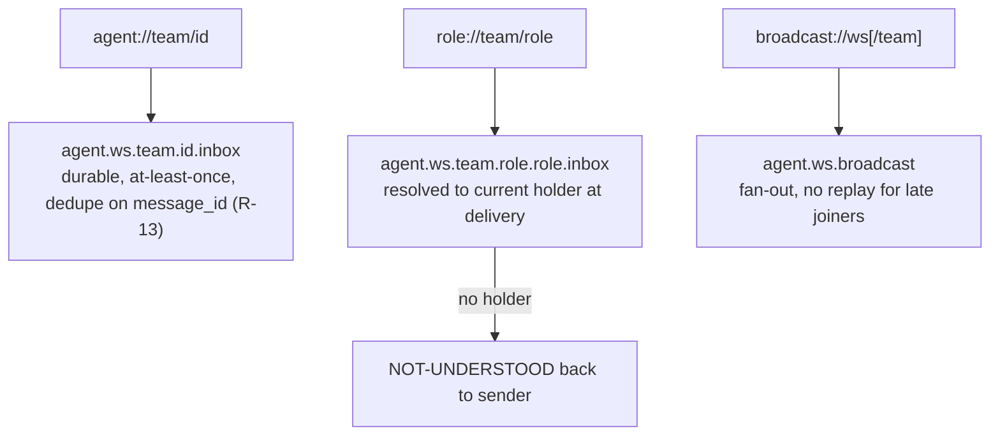
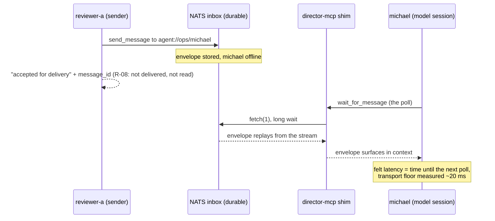
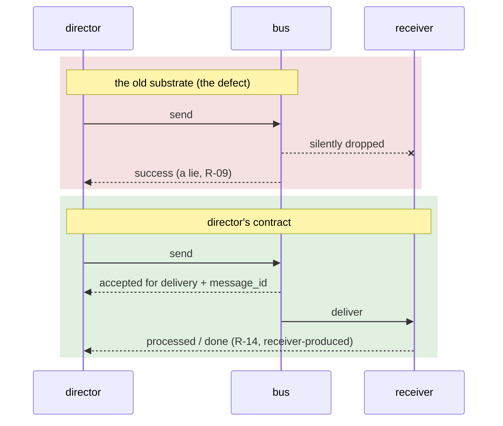
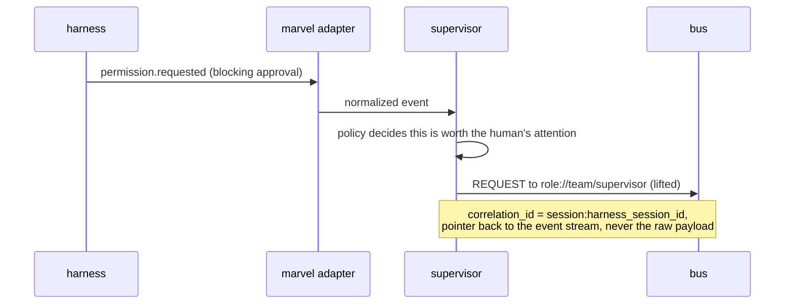
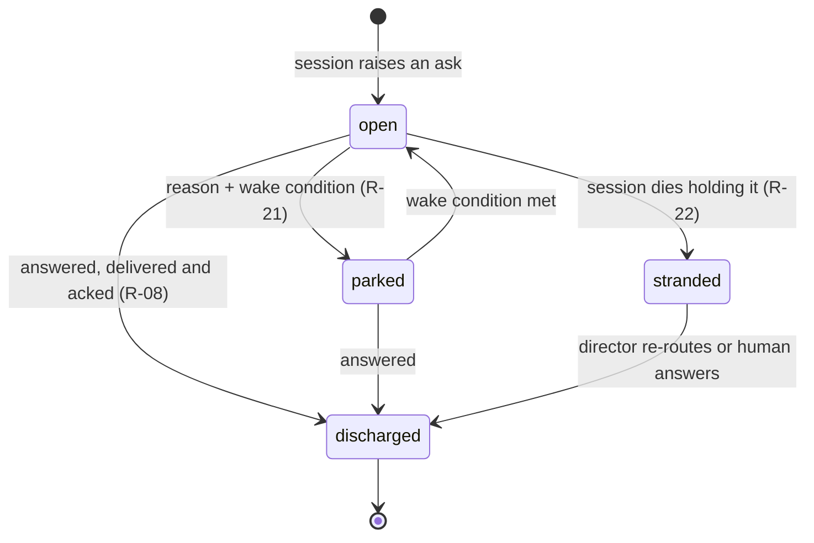
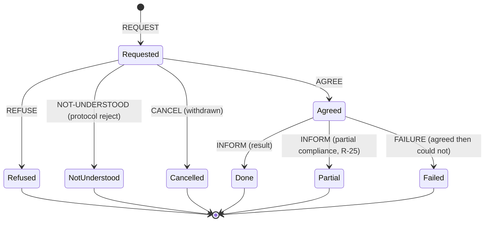

# Director architecture

How the pieces fit, in diagrams. The prose that governs each shape lives in
`../sim/requirements.md` (the R-numbers cited below) and the envelope design
in `aae-orc/docs/design/director-envelope-and-adapter-events.md`. This file is
the picture; those files are the contract.

Status: the transport is proven (NATS Phase 0 probe, `../probe/nats-phase-0/`),
the director software proper is unbuilt, and the role runs as a skill a session
plays by hand. Diagrams show the target shape, with the current reality called
out where it differs.

## System overview

One human with one attention budget. Director spends it well and loses nothing
while it does. Sessions join a message bus through a small per-session shim; the
custody store is director's own memory and needs no transport at all.

The custody store sits beside director, not on the bus, on purpose: R-34 says
director's first useful product is a board that needs no transport, and R-42
says the store survives a restart with the queue intact. Routing is downstream
of custody, never the other way around.

## The reachability reality today

Measured on one machine (`../skills/director/reference/adapters.md`): of four
installed harnesses, exactly one exposes presence or an address. The other
three can be read off disk and cannot be messaged. This is why director cannot
be a thin wrapper over any single harness.

R-27 is the rule this reality forces: adapters declare what they supply, and
director degrades per capability rather than assuming a session can be reached.

## Addressing

An envelope names a recipient by address. The bus resolves the address to a
subject. Three address forms, each with its own delivery guarantee.

## Sequence: receive is a poll, not a push

The Phase 0 probe settled this in code (finding-160, finding-159). MCP is
request and response, so a shim cannot originate a message into a running
model's context. The message waits in the durable inbox until the model calls
`wait_for_message`. Store-and-forward (R-22) means a message sent to an absent
session is not lost; it replays when that session first pulls.

## Sequence: acknowledgement comes from the receiver

The defect that started the project: in session 1, five messages were dropped
while every send returned success. R-08 rules that the send call acknowledges
nothing but acceptance; only the receiver, after processing, produces liveness
(R-14). R-09 rules that an undeliverable message must be loud.

## Sequence: the lift (marvel seam)

Director carries speech; marvel's adapters carry observations. A supervisor
(or an adapter, by policy) may lift an observation into an envelope. Lifting is
explicit, never automatic mirroring, so the bus carries decisions and signals
rather than raw telemetry.

## State: the lifecycle of an ask

An ask is not binary. R-21 gives it explicit states, R-22 makes it survive the
session that raised it, and R-24 keeps blocked distinct from failed and from
done. The state that costs the most when it is missed is `stranded`: a dead
process leaves no roster entry, so without custody the ask vanishes with it.

## Transaction: the performative handshake

An envelope's `performative` (a 12-verb FIPA-ACL subset) is the state of a
commitment, not just a message type. A REQUEST is answered by AGREE or REFUSE;
an agreed request that cannot be met is a FAILURE, which R-25 keeps distinct
from partial compliance and R-24 keeps distinct from a plain refusal.

## Where to go next

- Worked use cases with diagrams: `use-cases.md`
- The requirements each diagram serves: `../sim/requirements.md`
- The transport probe that proved the bus: `../probe/nats-phase-0/PROGRESS.md`
- The envelope and adapter-event co-design:
  `aae-orc/docs/design/director-envelope-and-adapter-events.md`
