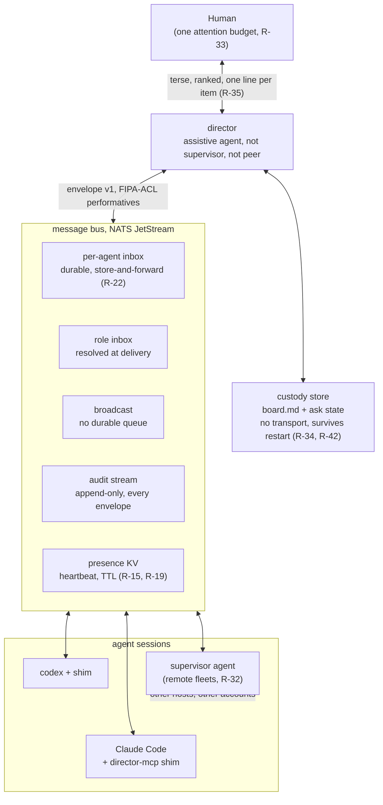
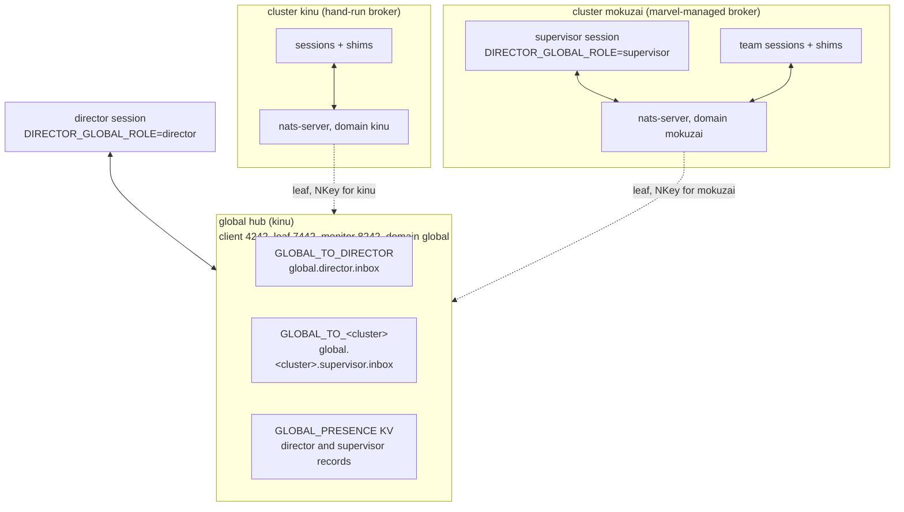
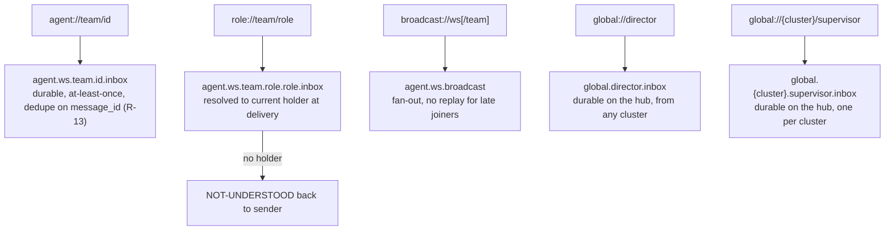
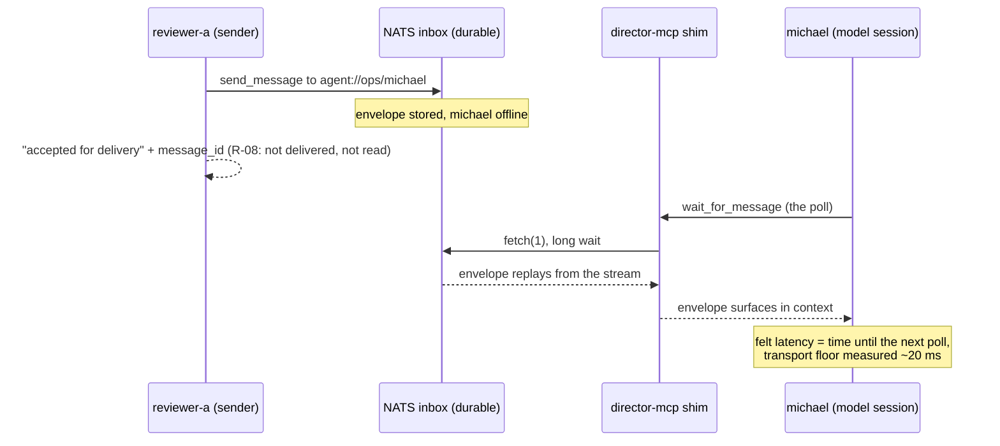
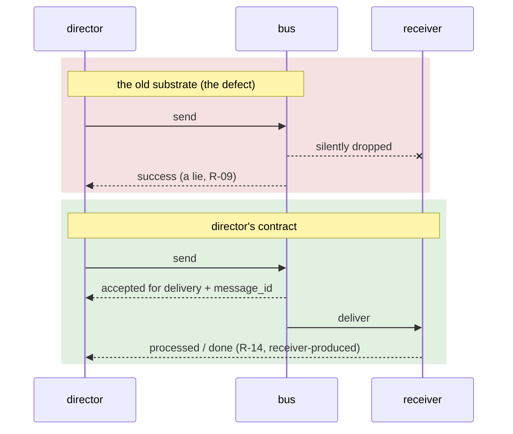
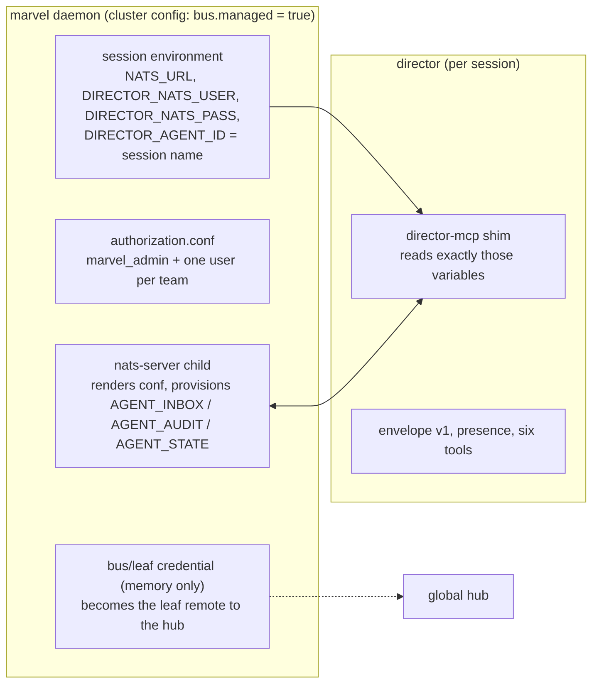
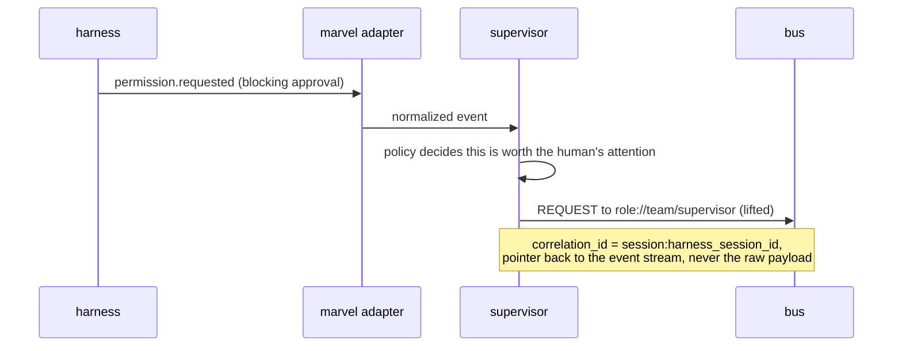
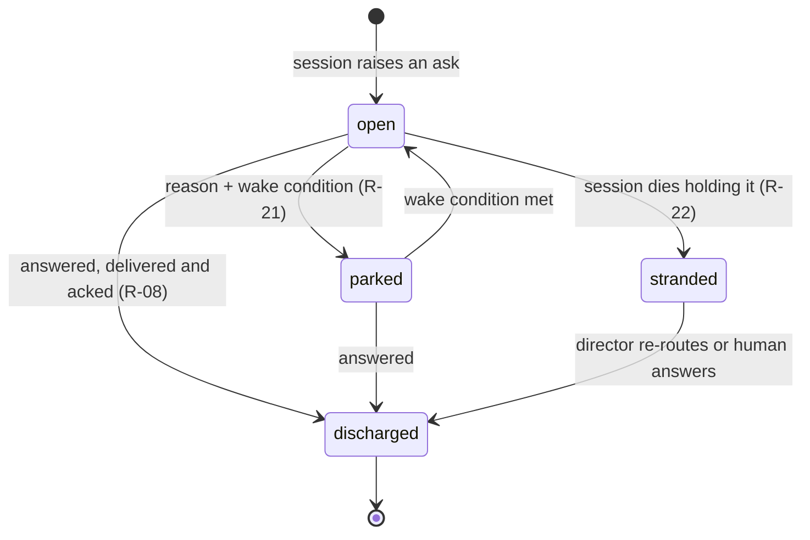
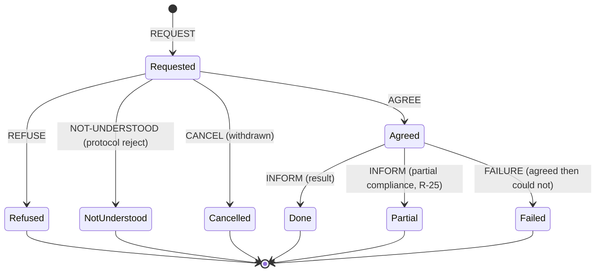
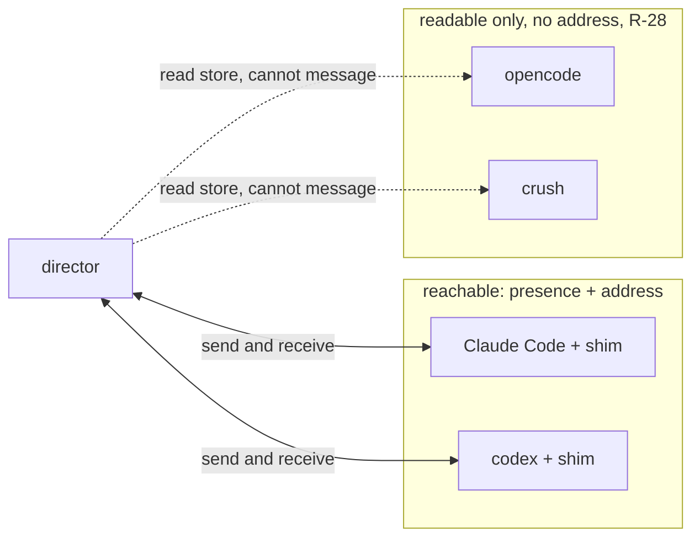

# Director architecture

How the pieces fit, in diagrams. The prose that governs each shape lives in
`../sim/requirements.md` (the R-numbers cited below) and the envelope design
in `aae-orc/docs/design/director-envelope-and-adapter-events.md`. This file is
the picture; those files are the contract.

Status: the transport is proven (NATS Phase 0 probe, `../probe/nats-phase-0/`),
the global tier runs as a hub with leaf clusters (`../probe/nats-global-tier/`),
marvel provisions and credentials the local tier for the fleets it manages
(`../sim/twin/`), and the director software proper is unbuilt: the role runs as
a skill a session plays by hand. Diagrams show the target shape, with the
current reality called out where it differs. Operating detail is in
`getting-started.md` and `shim-reference.md`.

## System overview

One human with one attention budget. Director spends it well and loses nothing
while it does. Sessions join a message bus through a small per-session shim; the
custody store is director's own memory and needs no transport at all.



The custody store sits beside director, not on the bus, on purpose: R-34 says
director's first useful product is a board that needs no transport, and R-42
says the store survives a restart with the queue intact. Routing is downstream
of custody, never the other way around.

## The two tiers

One broker per cluster carries team traffic; one global broker carries the
director channel between clusters and hosts (R-86). A session keeps a single
connection, to its local broker. Global traffic rides a leaf link the local
broker holds to the hub, authenticated with a cluster-scoped NKey the hub
operator minted. The director's own session connects to the hub directly.



The hub binds each leaf credential to its cluster's subject prefix, so a
cluster can publish only into its own global subjects and the director's inbox.
A down hub is an observable, never a health state: local traffic continues,
global sends queue on the leaf side until the link returns. The hub's
configuration, provisioning, and the per-host recipe are in
`../probe/nats-global-tier/`.

## Addressing

An envelope names a recipient by address. The bus resolves the address to a
subject. Five address forms, each with its own delivery guarantee. The first
three stay inside the cluster; the last two cross it.



A global address carries no workspace token. The cluster name stands in for
it, which is why marvel validates a cluster name as a subject token and why a
shim needs `DIRECTOR_CLUSTER` before it can send or receive globally (R-92).
The workspace in `DIRECTOR_WORKSPACE` still scopes every local address.

## Sequence: receive is a poll, not a push

The Phase 0 probe settled this in code (finding-160, finding-159). MCP is
request and response, so a shim cannot originate a message into a running
model's context. The message waits in the durable inbox until the model calls
`wait_for_message`. Store-and-forward (R-22) means a message sent to an absent
session is not lost; it replays when that session first pulls.



## Sequence: acknowledgement comes from the receiver

The defect that started the project: in session 1, five messages were dropped
while every send returned success. R-08 rules that the send call acknowledges
nothing but acceptance; only the receiver, after processing, produces liveness
(R-14). R-09 rules that an undeliverable message must be loud.



## The marvel seam

Director owns the protocol: the envelope, the addresses, the shim, the hub.
Marvel owns the substrate under a managed fleet: the local broker, its
provisioning, per-team credentials, and the identity every session is stamped
with at spawn. Neither requires the other (a hand-run broker and a hand-set
environment reproduce everything below), and the seam is four environment
variables.



What marvel supplies, and what it does not:

- **Broker and streams.** Started before any session, provisioned with the
  parameters the shim expects, reloaded when teams change, restarted under
  backoff if it exits. No session spawns while the bus is down or bare.
- **Identity.** `DIRECTOR_AGENT_ID` is the marvel session name
  (`<team>-<role>-g<gen>-<index>`), so a bus id is unique per generation and
  a shift produces a new presence record rather than a collision.
- **Credentials.** A per-team broker user confined to that team's subtree;
  the leaf seed for the hub held in daemon memory and pushed by the hub
  operator over a scoped `mrvl://` key. Neither is written to disk by
  marvel outside the broker's 0600 authorization file.
- **Not the protocol.** Marvel never reads or writes an envelope. It does
  not know what a REQUEST is, and its events are observations, not speech.

### Sequence: the lift

Director carries speech; marvel's adapters carry observations. A supervisor
(or an adapter, by policy) may lift an observation into an envelope. Lifting is
explicit, never automatic mirroring, so the bus carries decisions and signals
rather than raw telemetry. This is target shape; today the supervisor is a
session reading `marvel events`.



### Sequence: the cast under marvel (the twin)

`../sim/twin/` is the worked instance: a marvel manifest for a fleet whose
sessions join the bus at spawn. The launcher in the manifest's `command` is a
shell wrapper that runs the shim's preflight, then execs the harness with the
shim registered.

```mermaid
sequenceDiagram
  participant M as marvel reconciler
  participant T as tmux pane
  participant L as cast-launch.sh
  participant Sh as director-mcp
  participant B as local broker
  participant H as Claude Code

  M->>B: broker ready, provisioned (bus.started, bus.provisioned)
  M->>T: spawn: env = MARVEL_*, NATS_URL, DIRECTOR_NATS_USER/PASS, DIRECTOR_AGENT_ID
  T->>L: exec
  L->>Sh: director-mcp --preflight
  Sh->>B: connect, check streams and KV
  alt preflight fails
    Sh-->>L: exit 2 (config) or 1 (connect)
    L-->>T: exit non-zero
    Note over M: session.crashed, charged to the role; no silent running-with-no-presence
  else ok
    L->>H: exec claude, adapter flags passed through, shim as an MCP server
    H->>Sh: MCP handshake
    Sh->>B: presence record (TTL 90 s, renewed every 30 s), durable consumer mcp_&lt;id&gt;_&lt;instance&gt;
    H-->>M: statusline heartbeat (marvel health) while the shim keeps presence (director liveness)
  end
```

Two liveness signals, two owners, on purpose. Marvel's heartbeat says the
process is alive and how full its context is; director's presence says the
agent can be reached. A session can have one without the other, and finding-166
is the case where a bus that was down or unprovisioned let a session report
running with no presence; the preflight in the launcher is what closes it.

## State: the lifecycle of an ask

An ask is not binary. R-21 gives it explicit states, R-22 makes it survive the
session that raised it, and R-24 keeps blocked distinct from failed and from
done. The state that costs the most when it is missed is `stranded`: a dead
process leaves no roster entry, so without custody the ask vanishes with it.



## Transaction: the performative handshake

An envelope's `performative` (a 12-verb FIPA-ACL subset) is the state of a
commitment, not just a message type. A REQUEST is answered by AGREE or REFUSE;
an agreed request that cannot be met is a FAILURE, which R-25 keeps distinct
from partial compliance and R-24 keeps distinct from a plain refusal.



## The reachability reality today

Measured on one machine (`../skills/director/reference/adapters.md`): of four
installed harnesses, exactly one exposes presence or an address without the
shim. The other three can be read off disk and cannot be messaged. With the
shim, any harness that speaks MCP joins the bus; codex does today.



R-27 is the rule this reality forces: adapters declare what they supply, and
director degrades per capability rather than assuming a session can be reached.

## Where to go next

- Get two sessions talking: `getting-started.md`
- Every variable, tool, subject, and field: `shim-reference.md`
- Worked use cases with diagrams: `use-cases.md`
- The requirements each diagram serves: `../sim/requirements.md`
- The transport probe that proved the bus: `../probe/nats-phase-0/PROGRESS.md`
- The global tier, hub side: `../probe/nats-global-tier/`
- The fleet as a manifest: `../sim/twin/`
- The envelope and adapter-event co-design:
  `aae-orc/docs/design/director-envelope-and-adapter-events.md`
