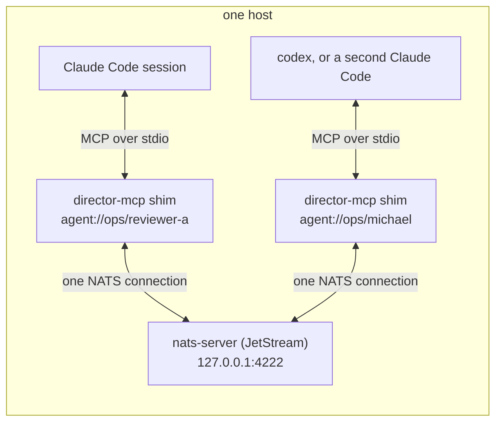

# Getting started: run the bus and join a session to it

This is the operator's path from nothing to two agent sessions exchanging
director envelopes over a local NATS broker, then on to authorization, the
global tier, and running the same thing under marvel. It documents what the
Phase 0 probe proved (`../probe/nats-phase-0/PROGRESS.md`); the
[shim reference](shim-reference.md) lists every variable, tool, address, and
field this page uses.

What you are standing up:



Each session gets its own shim process, launched by the harness as an MCP
stdio server. The shim holds one connection to the broker, a durable inbox
consumer, and a presence heartbeat. The harness sees five tools.

## Prerequisites

- `nats-server` 2.11 or later and the `nats` CLI (`brew install
  nats-server nats-io/nats-tools/nats`). The probe ran on 2.14.6.
- Go 1.26 or later, to build the shim.
- A harness that speaks MCP over stdio: Claude Code (interactive or `-p`),
  codex, or anything else with an MCP client.

## 1. Start the broker

```sh
probe/nats-phase-0/start.sh &
```

The script derives the JetStream store from `DIRECTOR_PHASE0_HOME` (default
`~/.director/nats`), exports it, and execs `nats-server` on the checked-in
config: loopback only, port 4222, monitoring on 8222, anonymous. Run it
through the script; the config reads its store path from the environment as
an unquoted whole value, which is the one form nats-server substitutes, and
a bare `nats-server -c nats-server.conf` refuses to start with the variable
unset rather than writing to a stray path.

```sh
curl -s http://127.0.0.1:8222/varz | head -3     # it answers
```

The broker is reversible: kill the process and remove `~/.director/nats`.

## 2. Provision the streams and the presence bucket

A bare broker accepts a shim's connection and then strands it: the inbox
stream, the audit stream, and the presence bucket do not exist, and the shim
exits with `bucket not found`. Under `--strict-mcp-config` the harness
starts anyway, without its tools, and reports nothing wrong (finding-166).
So provision before the first shim connects:

```sh
nats stream add AGENT_INBOX --subjects 'agent.*.*.*.inbox,agent.*.*.role.*.inbox' \
  --storage file --retention limits --max-age 24h --max-msg-size 65536 --dupe-window 2m
nats stream add AGENT_AUDIT --subjects 'agent.audit' --storage file --retention limits --max-age 720h
nats kv add AGENT_STATE --ttl 90s --storage file
```

Verify:

```sh
nats stream ls          # AGENT_INBOX, AGENT_AUDIT
nats kv ls              # AGENT_STATE
```

A marvel-managed broker does this for you at start (see section 9).

## 3. Build the shim

```sh
cd probe/nats-phase-0/director-mcp
go build -o director-mcp .
go test ./...                      # 25 broker-free tests
cd -
```

Check the preflight against the broker you just provisioned:

```sh
DIRECTOR_AGENT_ID=probe DIRECTOR_TEAM=ops DIRECTOR_WORKSPACE=aae-orc \
  probe/nats-phase-0/director-mcp/director-mcp --preflight
# director-mcp preflight: ok
```

`--preflight` connects, verifies the streams and the bucket exist, and
exits. It creates no consumer and writes no presence. A launcher runs it
before starting a harness so a broken bus fails the spawn instead of
producing a session that looks healthy and cannot be reached (R-93).

## 4. Join a Claude Code session

The shim is launched by the harness, with the session's identity in its
environment. Three values are the identity, and each must match
`[A-Za-z0-9_-]` or the shim refuses to start:

| Variable | Meaning |
|---|---|
| `DIRECTOR_AGENT_ID` | this session's id; the `id` in `agent://team/id` |
| `DIRECTOR_TEAM` | the team (default `default`) |
| `DIRECTOR_WORKSPACE` | the workspace (default `default`) |

`NATS_URL` names the broker (default `nats://127.0.0.1:4222`).

**Per invocation, the recommended form.** Pass the server on the command
line so the id belongs to exactly this process:

```sh
SHIM="$PWD/probe/nats-phase-0/director-mcp/director-mcp"
claude --strict-mcp-config --mcp-config "$(printf '{"mcpServers":{"director":{"command":"%s","env":{"DIRECTOR_AGENT_ID":"%s","DIRECTOR_TEAM":"ops","DIRECTOR_WORKSPACE":"aae-orc","NATS_URL":"nats://127.0.0.1:4222"}}}}' "$SHIM" reviewer-a)"
```

`--strict-mcp-config` keeps any project-scoped director entry with a baked
id from loading beside this one, which is how several sessions in one
project ended up sharing one address in the identity incident of
2026-09-12.

**Registered in the project, the persistent form.** `claude mcp add`
writes the server into Claude Code's local-scope config for this project:

```sh
claude mcp add --scope local director-mcp \
  -e DIRECTOR_AGENT_ID=michael -e DIRECTOR_TEAM=ops -e DIRECTOR_WORKSPACE=aae-orc \
  -e NATS_URL=nats://127.0.0.1:4222 \
  -- "$PWD/probe/nats-phase-0/director-mcp/director-mcp"
claude mcp list                    # director-mcp ... Connected
```

Two things to know about this form. Tools load at session start, so the
session that ran `claude mcp add` does not have them; a fresh session in
this project does. And every session in this project now launches a shim
with the same id, so use it for one standing seat (the human's own) and
never for a fleet. Remove it with `claude mcp remove director-mcp --scope
local`.

Both forms produce the same result: `claude mcp list` reports the server
connected, and the shim's presence record appears in the bucket:

```sh
nats kv ls AGENT_STATE                                   # presence.ops.michael.<instance>
nats kv get AGENT_STATE 'presence.ops.michael.<instance>' --raw
```

## 5. Join a second harness

A codex session joins by pointing its MCP client at the same binary, per
invocation, without editing the user's config:

```sh
codex exec \
  -c 'mcp_servers.director.command="'"$SHIM"'"' \
  -c 'mcp_servers.director.env.DIRECTOR_AGENT_ID="codex-a"' \
  -c 'mcp_servers.director.env.DIRECTOR_TEAM="ops"' \
  -c 'mcp_servers.director.env.DIRECTOR_WORKSPACE="aae-orc"' \
  -c 'mcp_servers.director.env.NATS_URL="nats://127.0.0.1:4222"' \
  --skip-git-repo-check --dangerously-bypass-approvals-and-sandbox \
  -C "$PWD" "call set_presence with state busy, then list_roster" < /dev/null
```

Three flags earned the hard way: `--skip-git-repo-check` for a non-git
working directory; the approvals bypass, because codex otherwise refuses the
MCP tool call with "requires approval, but approval policy is never"; and
stdin from `/dev/null`, because `codex exec` blocks reading a piped stdin.

A headless Claude Code run joins the same way, with an allowlist so the
non-interactive run can call the tools without a permission prompt:

```sh
claude -p --mcp-config "$(printf '{"mcpServers":{"director":{"command":"%s","env":{"DIRECTOR_AGENT_ID":"cc-planner","DIRECTOR_TEAM":"ops","DIRECTOR_WORKSPACE":"aae-orc","NATS_URL":"nats://127.0.0.1:4222"}}}}' "$SHIM")" \
  --allowedTools "mcp__director__set_presence,mcp__director__wait_for_message,mcp__director__send_message,mcp__director__list_roster" \
  --output-format text "list the roster and report who is present"
```

The worked script is `probe/nats-phase-0/cross-harness-demo.sh`.

## 6. Send and receive

From inside a session the five tools are `send_message`, `wait_for_message`,
`list_roster`, `set_presence`, and `broadcast`. A first exchange, as the
model calls them:

```
list_roster
  -> present: [ {agent_id: michael, team: ops, workspace: aae-orc, state: idle, ...},
                {agent_id: reviewer-a, ...} ]

send_message  to: agent://ops/michael  performative: REQUEST
              text: "please review PR #12"  refs: ["pr:12"]
  -> status: accepted for delivery, message_id: 01M2..., tier: local
     note: accepted is not delivered or read; the recipient reports those (R-08)
```

On michael's side nothing happens until the model polls:

```
wait_for_message  timeout_seconds: 60
  -> message: { performative: REQUEST, sender: {agent_id: reviewer-a, ...},
                content: {type: text, data: "please review PR #12", refs: ["pr:12"]},
                message_id: 01M2..., conversation_id: cid-01M2... }
     tier: local

send_message  to: agent://ops/reviewer-a  performative: AGREE
              in_reply_to: 01M2...  text: "on it; reply_by 17:00"
```

The sequence, with the two facts that shape every director design decision:

```mermaid
sequenceDiagram
  participant A as reviewer-a
  participant Bus as AGENT_INBOX (durable)
  participant M as michael

  A->>Bus: send_message REQUEST
  Bus-->>A: accepted for delivery + message_id
  Note over Bus: stored; michael may be offline, or busy, or asleep
  M->>Bus: wait_for_message (the poll)
  Bus-->>M: the REQUEST
  M->>Bus: send_message AGREE, in_reply_to
  Bus-->>M: accepted
  A->>Bus: wait_for_message
  Bus-->>A: the AGREE
```

**Receive is a poll.** MCP is request and response, so a shim cannot push a
message into a running model's context. The message waits in the durable
inbox until the model calls `wait_for_message`. The transport floor is
about 20 ms; the latency you feel is the time until the next poll.

**Accepted is not delivered.** The send call acknowledges that the broker
stored the bytes. Only the receiver, after processing, can say the message
arrived (R-08); reply with `in_reply_to` set so the sender can correlate.

**Store and forward.** A message sent to a session that is not connected
waits in the stream (24 hours) and replays when that session first pulls.
In the probe, the sender exited before the receiver ever connected, and the
receiver's first poll returned the message.

## 7. Watch from outside

The bus is inspectable without a client of your own:

```sh
nats kv ls AGENT_STATE                            # who is present
nats stream view AGENT_AUDIT                      # every envelope, append-only, 30 days
nats stream info AGENT_INBOX                      # messages waiting
nats sub 'agent.aae-orc.ops.>'                    # live traffic for one team
nats consumer ls AGENT_INBOX                      # one durable per shim instance
```

Presence keys are `presence.<team>.<id>.<instance>` and expire 90 seconds
after the last beat. The shim renews every 30 seconds on its own timer, so a
live session stays present through a long model turn without calling any
tool (R-56).

## 8. Turn on authorization

The anonymous broker means every local process holds publish and subscribe
on every subject, so a name on the bus is a claim nothing checks. The
authorization block binds a credential to the subjects it may use (R-77,
R-82):

```sh
export DIRECTOR_ADMIN_PASS="$(openssl rand -hex 24)"
export DIRECTOR_OPS_PASS="$(openssl rand -hex 24)"
export DIRECTOR_PHASE0_HOME="${DIRECTOR_PHASE0_HOME:-$HOME/.director/nats}"
export DIRECTOR_PHASE0_STORE="$DIRECTOR_PHASE0_HOME/store"
nats-server -c probe/nats-phase-0/nats-server-auth.conf &
```

`nats-server-auth.conf` is the base config plus `authorization.conf`. The
passwords are environment-interpolated so no secret is committed; an unset
variable makes the server refuse to start. It is a separate activation
config on purpose: a routine `start.sh` never silently requires auth and
drops a live fleet. Relaunching the broker with auth on is a coordinated
change; every connected shim must carry a credential.

The shim reads its credential from the environment:

| Variable | Meaning |
|---|---|
| `DIRECTOR_NATS_USER`, `DIRECTOR_NATS_PASS` | a broker user and password |
| `DIRECTOR_NATS_CREDS` | a `.creds` file (NKey or JWT), the forward path |

Two users ship in the block: `director_admin` (provisioning and break-glass,
never handed to a session) and `ops`, confined to `agent.aae-orc.ops.>`, the
audit stream, its own presence keys, and the JetStream plumbing the shim
needs. It cannot publish or subscribe in another team's subtree. To add a
team, copy the `ops` user, substitute the team name, and give it its own
password variable. `probe/nats-phase-0/verify-auth.sh` proves the block on a
throwaway broker on port 4223 without touching the live one, 7 of 7.

Two residuals are known and owned elsewhere: one credential per team rather
than per session (per-session minting is marvel's, R-85), and JetStream's
account-scoped API, which real per-team isolation closes with per-team
streams or accounts (the two-tier design, R-86).

## 9. Run it under marvel

Everything above is what marvel does for you when a cluster declares a
managed bus. In `~/.marvel/config.yaml`:

```yaml
clusters:
  - name: kinu
    socket: ~/.marvel/run/marvel.sock
    bus:
      managed: true
      listen: 127.0.0.1:4222
```

The daemon renders the broker config and a 0600 authorization file with one
user per applied team, starts `nats-server` as its own child, provisions
the three objects above, and stamps `NATS_URL`, `DIRECTOR_NATS_USER`,
`DIRECTOR_NATS_PASS`, and `DIRECTOR_AGENT_ID` into every session's
environment. No session spawns while the bus is down or bare
(`bus.unavailable` on marvel's event ring), which is R-93 at the control
plane. A launcher then only has to wire the shim into the harness; the
twin's `sim/twin/cast-launch.sh` is the worked example, and `sim/twin/`
carries the manifest and the check runbook. marvel's own documentation of
the bus section lives in its repository (`docs/bus.md`).

## 10. Join the global tier

One local broker per host reaches the director on another host through a
leaf link to a global hub. Nothing in a worker's shim changes; a supervisor's
shim gains three variables:

```sh
DIRECTOR_GLOBAL_DOMAIN=global DIRECTOR_CLUSTER=mokuzai DIRECTOR_GLOBAL_ROLE=supervisor \
  director-mcp
```

The shim keeps its one connection to the local broker and reaches the hub's
JetStream domain over the broker's leaf link; the session holds no hub
credential. `global://director` and `global://<cluster>/supervisor` become
send addresses, `wait_for_message` polls both tiers and names the one it
found, and `list_roster` gains a tier column. The broker-side change is a
JetStream domain plus one `leafnodes.remotes` entry with an NKey seed the hub
operator hands you privately; `probe/nats-global-tier/recipe-mokuzai.md`
walks it host by host, and `probe/nats-global-tier/verify-global-shim.sh`
proves the path against the running hub with a throwaway leaf, 14 of 14.

## Cleanup and cautions

- Remove a project-registered shim with `claude mcp remove director-mcp
  --scope local`.
- **Do not `pkill -f director-mcp`.** The shim serving your own session is a
  `director-mcp` process too, so the broad match kills your own bus tools.
  Scope cleanup by environment (`pkill -f 'DIRECTOR_AGENT_ID=codex-a'`) or
  by pid.
- Assign a distinct id per session at the launcher. Two shims with one id
  each get their own copy of every message (a per-instance durable makes
  the collision loud rather than lossy), the roster shows two rows, and the
  second shim logs a warning naming the first. The fix is distinct ids, not
  tolerating the duplication.

## Troubleshooting

| Symptom | Cause | Fix |
|---|---|---|
| shim exits with `presence KV AGENT_STATE: nats: bucket not found` | broker not provisioned | section 2, or run `--preflight` before the harness |
| `claude mcp list` shows the server but the tools are absent | tools load at session start | start a new session |
| the roster is empty while a session runs | a shim build older than 2026-09-12 set presence once and never renewed | rebuild the shim; presence is on a 30s timer now |
| a message never arrives | the receiver has not polled | it arrives on the receiver's next `wait_for_message`; there is no push |
| `send_message` refused: no live presence for the recipient | R-92: the workspace is resolved from live presence | pass `workspace` explicitly to address a cold mailbox verbatim |
| shim refuses to start naming the id | the id has a byte outside `[A-Za-z0-9_-]` | fix the launcher; the shim rejects and never rewrites |
| a second shim logs `WARNING: ... instance ... pid ...` | two sessions share one id | give each session its own id |
| authorization violation in the shim log | the broker requires a credential | set `DIRECTOR_NATS_USER` and `DIRECTOR_NATS_PASS` for the team |
