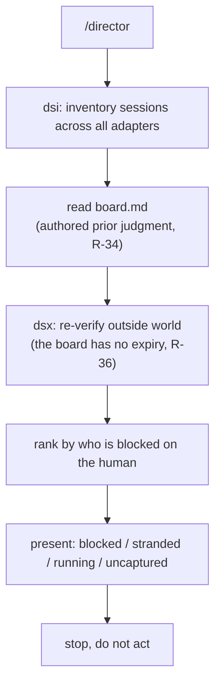
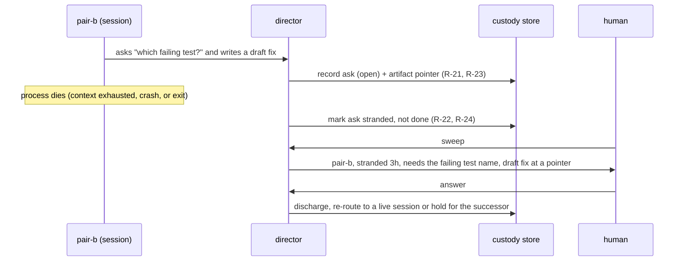
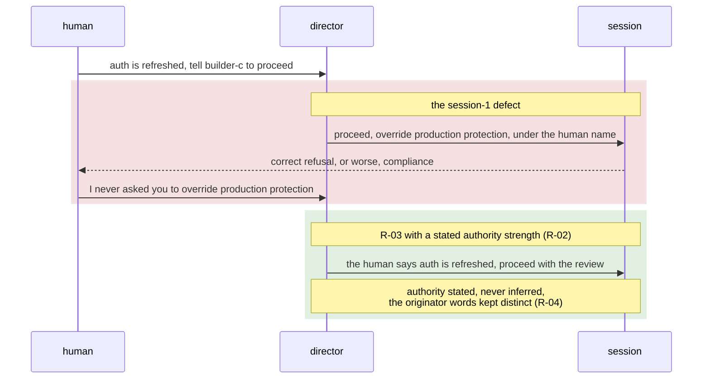
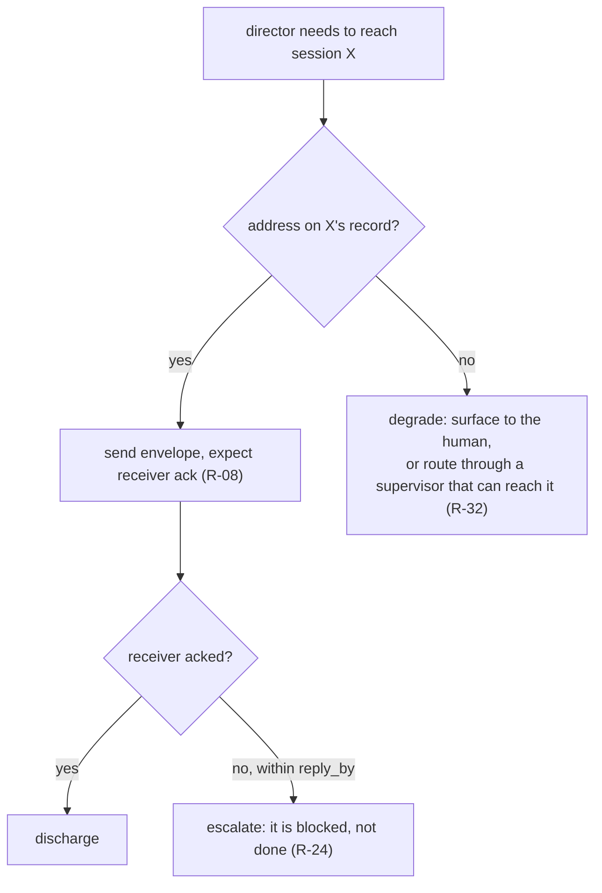

# Director use cases

Four things a human running several agent sessions needs, each drawn from a
real moment in the session-1 simulation (2026-09-04) and each tied to the
requirements it exercises. The architecture that serves them is in
`architecture.md`.

## UC1. Sweep: what is blocked on me?

The default and cheapest invocation (`/director`). Regenerate the inventory,
read the board, present what is waiting on the human, stop. Do not act. The
output contract is terse and ranked by rule (R-35): one line per item, detail
on request. Session 1's operator complaint, "can you get to the point, these
summaries are a wall of distracting text," is itself R-35.



Output shape:

```
Blocked on you (2)
1. reviewer-a - approve production override for PR #12
2. builder-c  - which base branch for the release cut?

Stranded (1)  [dead process, ask never answered]
7. pair-b - needs the failing test name  (died 3h ago)

Running, not blocked: docs-a, triage-e
Uncaptured: builder-c wrote a migration nobody has filed
```

## UC2. Custody of a stranded ask

The core value, and the one that made the project. A session does good work,
raises a question, and dies before the human answers. Without custody the ask
dies with the process, because a dead process leaves no roster entry (R-22).
Director holds the ask, and the artifact reference outlives the session that
made it (R-23).



The distinction R-24 draws is load-bearing here: a stranded ask is neither
failed nor done. Treating a dead session as done, which the wizard did by hand
in session 1, is exactly the COULD NOT DO IT failure the capture triggers exist
to catch.

## UC3. Relay without borrowing authority

Interpreting is the job; director carries meaning rather than transcribing nine
transcripts. Exactly one thing is ruled out, and it is about authority, not
language (R-03): director must not represent itself as carrying authority it
was not given. In session 1 the human said auth was refreshed and to tell a
session to proceed; director sent an instruction naming a production resource,
under the human's name. The correction was "I never asked you to override
production protection, you made that assumption on your own." The defect was the
claim, not the paraphrase.



R-39 is the reason this cannot be left to the receiver: both correct refusals
in session 1 came from sessions on the same harness, which injects its own
policy paragraph around inbound messages. codex, opencode, and crush inject
nothing. That borrowed safety is a property of the substrate, not the fleet, so
safety behavior must be director's to supply and portable across harnesses
(R-38, R-39).

## UC4. A heterogeneous fleet, degraded per capability

The normal case is a fleet where sessions differ in what they expose. Director
plans against each session's declared capability, never against an assumption
that a session can be messaged (R-27, R-28). A readable-but-unreachable session
is not an error; it is Tuesday.



R-32 is what keeps this general: director addresses supervisors and local
sessions both. Direct management of the sessions on one machine is a first-class
case, not a degenerate one, and reaching a remote fleet through its supervisor
is the same operation at a different distance.

## The thread through all four

Every use case reduces to the one sentence: director's product is custody, not
coordination. The sweep is custody of attention, the stranded ask is custody of
work, the relay discipline is custody of authority, and the heterogeneous fleet
is custody across a boundary no single harness spans. Routing messages is
downstream of all of it.
