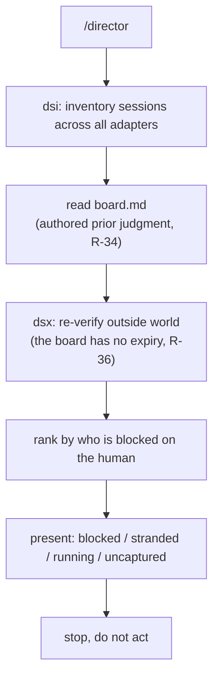
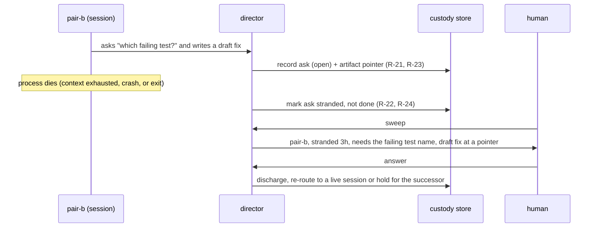
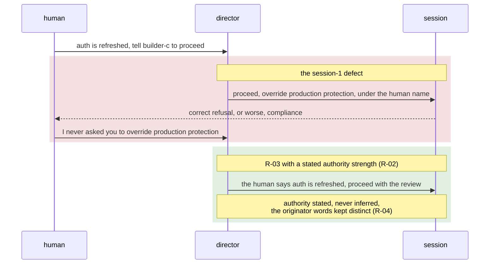
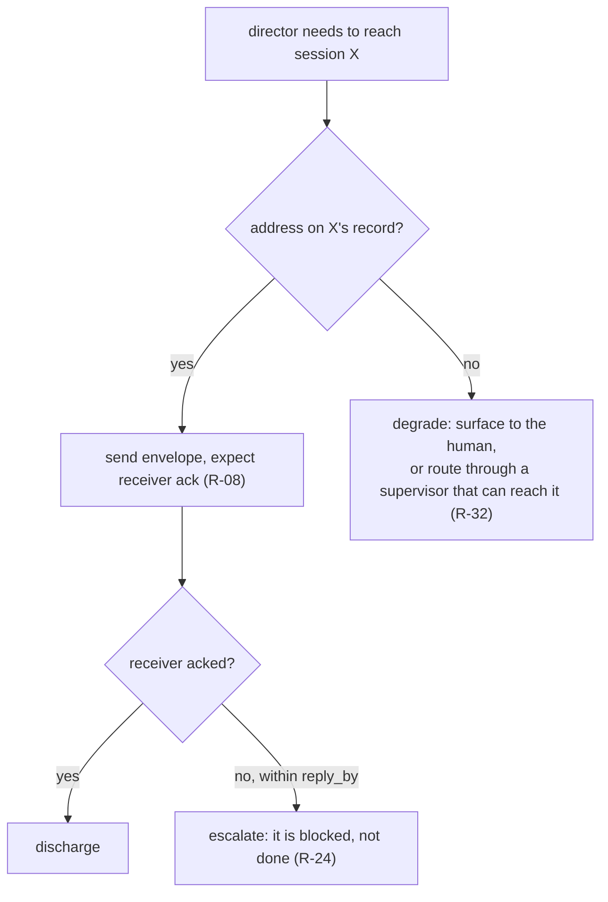
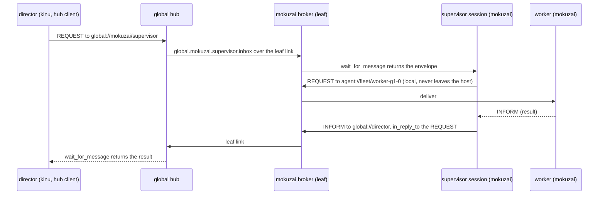
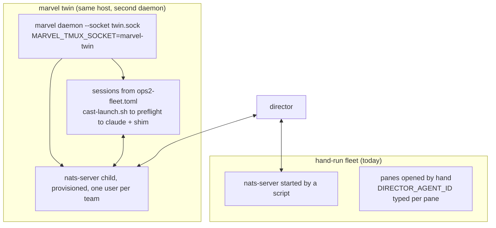

# Director use cases

Six things a human running several agent sessions needs. The first four are
drawn from real moments in the session-1 simulation (2026-09-04); the last two
from standing the two-tier bus and the marvel twin up (2026-09-14 and 15). Each
is tied to the requirements it exercises. The architecture that serves them is
in `architecture.md`; the commands are in `getting-started.md`.

## UC1. Sweep: what is blocked on me?

The default and cheapest invocation (`/director`). Regenerate the inventory,
read the board, present what is waiting on the human, stop. Do not act. The
output contract is terse and ranked by rule (R-35): one line per item, detail
on request. Session 1's operator complaint, "can you get to the point, these
summaries are a wall of distracting text," is itself R-35.



Output shape:

```
Blocked on you (2)
1. reviewer-a - approve production override for PR #12
2. builder-c  - which base branch for the release cut?

Stranded (1)  [dead process, ask never answered]
7. pair-b - needs the failing test name  (died 3h ago)

Running, not blocked: docs-a, triage-e
Uncaptured: builder-c wrote a migration nobody has filed
```

## UC2. Custody of a stranded ask

The core value, and the one that made the project. A session does good work,
raises a question, and dies before the human answers. Without custody the ask
dies with the process, because a dead process leaves no roster entry (R-22).
Director holds the ask, and the artifact reference outlives the session that
made it (R-23).



The distinction R-24 draws is load-bearing here: a stranded ask is neither
failed nor done. Treating a dead session as done, which the wizard did by hand
in session 1, is exactly the COULD NOT DO IT failure the capture triggers exist
to catch.

## UC3. Relay without borrowing authority

Interpreting is the job; director carries meaning rather than transcribing nine
transcripts. Exactly one thing is ruled out, and it is about authority, not
language (R-03): director must not represent itself as carrying authority it
was not given. In session 1 the human said auth was refreshed and to tell a
session to proceed; director sent an instruction naming a production resource,
under the human's name. The correction was "I never asked you to override
production protection, you made that assumption on your own." The defect was the
claim, not the paraphrase.



R-39 is the reason this cannot be left to the receiver: both correct refusals
in session 1 came from sessions on the same harness, which injects its own
policy paragraph around inbound messages. codex, opencode, and crush inject
nothing. That borrowed safety is a property of the substrate, not the fleet, so
safety behavior must be director's to supply and portable across harnesses
(R-38, R-39).

## UC4. A heterogeneous fleet, degraded per capability

The normal case is a fleet where sessions differ in what they expose. Director
plans against each session's declared capability, never against an assumption
that a session can be messaged (R-27, R-28). A readable-but-unreachable session
is not an error; it is Tuesday.



R-32 is what keeps this general: director addresses supervisors and local
sessions both. Direct management of the sessions on one machine is a first-class
case, not a degenerate one, and reaching a remote fleet through its supervisor
is the same operation at a different distance.

## UC5. A supervisor on another host, reached by name

The director sits on one machine; a fleet runs on another, behind its own
broker, under its own operator. The director should reach that fleet's
supervisor with one address and no knowledge of the other host's topology, and
the fleet's team traffic should never leave its host (R-86).



What makes this hold together:

- **One credential per cluster, minted by the hub operator,** bound on the
  hub to that cluster's subject prefix. A cluster can speak into its own
  global subjects and the director's inbox and nowhere else.
- **The supervisor keeps one connection,** to its local broker. Its global
  role is a declaration in its environment (`DIRECTOR_GLOBAL_ROLE=supervisor`,
  `DIRECTOR_CLUSTER=mokuzai`), not a second bus client.
- **Enrollment is a push, not a shared secret file.** For a marvel-managed
  cluster the hub operator pushes the seed over a `credential-push` scoped
  key and the broker restarts as a leaf; for a hand-run broker the operator
  drops the seed in the broker's environment. Either way the seed never
  crosses the wire in a message.
- **A down hub degrades, it does not fail.** Local traffic continues; a
  global send waits on the leaf side. Director sees the supervisor's presence
  record age out and reports the cluster unreachable, which is a fact about
  the link, not the fleet.

## UC6. The fleet as a manifest: the twin

The fleet that runs the platform's own work has been started by hand, one
pane at a time, with each session's bus identity set by whoever typed it.
The twin (`../sim/twin/`) stands the same roster up from a marvel manifest on
a second daemon beside the hand-run one, so the two can be compared before
either is trusted with the work.



What the twin changes for the director role:

- **Identity is stamped, not typed.** `DIRECTOR_AGENT_ID` is the marvel
  session name. A shift mints a new generation and therefore a new bus id;
  the old presence record ages out on its own. Nobody edits a pane's
  environment by hand.
- **Custody survives the session that raised it, again.** A session that
  crashes is replaced by marvel under backoff; the replacement pulls the
  durable inbox and the stranded ask surfaces to the new holder, with
  director's board still carrying the pointer (R-22, R-23). A shift is the
  same story on purpose: the departing generation's handoff is content the
  agent owns, the mechanics are marvel's.
- **Dead or unprovisioned is loud.** The launcher's preflight fails the spawn
  when the bus is down or bare, and marvel refuses to spawn at all until its
  managed broker is provisioned. The finding-166 case (a session reporting
  running with no presence) has no path left through the twin.
- **Two liveness signals, two owners.** Marvel's heartbeat and CTX% come from
  the harness statusline; director's presence comes from the shim. Director
  reads presence and never marvel's health, and marvel never reads an
  envelope. Each can be wrong without lying to the other.

The runbook, the manifest, and the launcher are in `../sim/twin/`; the marvel
side of the seam is documented in marvel's bus guide.

## The thread through all six

Every use case reduces to the one sentence: director's product is custody, not
coordination. The sweep is custody of attention, the stranded ask is custody of
work, the relay discipline is custody of authority, the heterogeneous fleet is
custody across a boundary no single harness spans, the remote supervisor is
custody across a host boundary, and the twin is custody that survives the
session being replaced by a machine rather than a human. Routing messages is
downstream of all of it.
