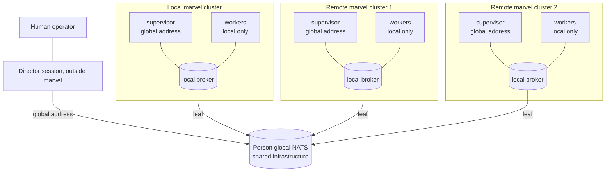
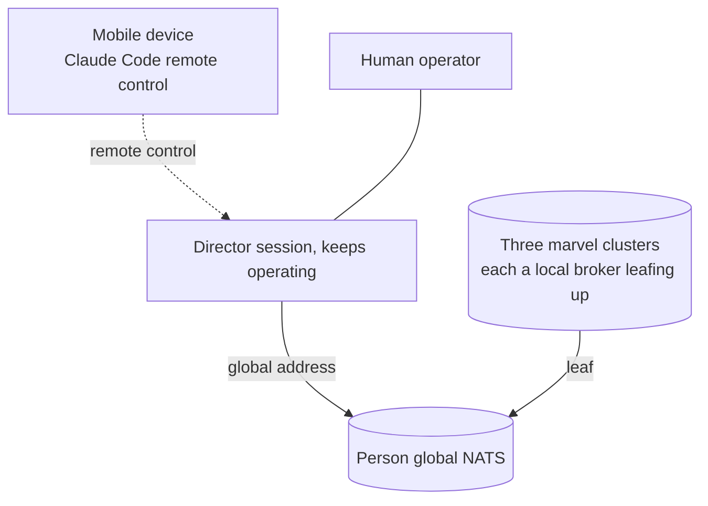
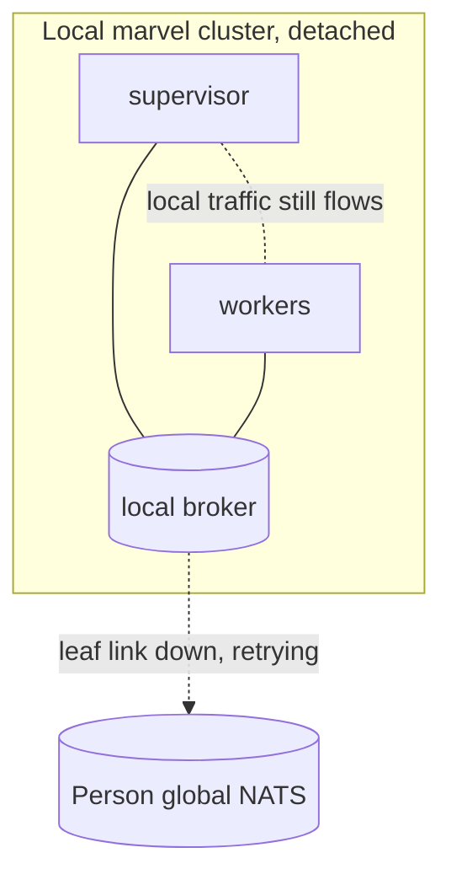
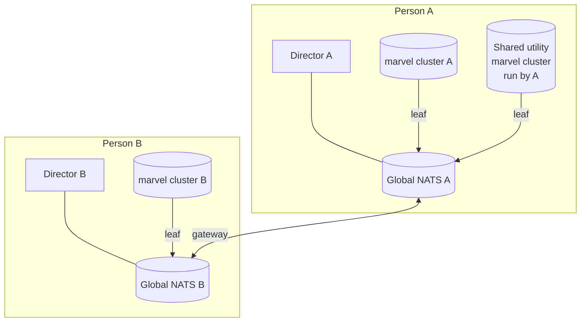

# Global NATS leaf-attach: moving the global bus onto shared infrastructure

Status: direction, recorded 2026-09-17. Not yet built. Extends
[global-bus-tier.md](global-bus-tier.md); it does not supersede it. The buildable
marvel-side work is tracked as bd `aae-orc-ct0l4`.

## Why this shift

The global bus today runs in an interim placement: a local per-cluster broker
plus a global hub that runs on the operator's own laptop (the R-86 placement).
That was always the interim, with a move to durable shared infrastructure
planned once the design was proven.

The direction, recorded 2026-09-17: move the GLOBAL NATS off the laptop onto the
shared infrastructure NATS. Deploy one NATS per person there once it is tested.
Make each person's LOCAL marvel a leaf node attached to their own global bridge
(a leaf-node topology). Later, possibly, gateways or cross-project communication,
offering services to other projects through a support or utility agent team they
can talk with.

## Target topology

- The shared infrastructure NATS is the durable, always-on global tier, deployed
  and operated through the infrastructure deploy pipeline (the operator's live
  work). One NATS per person on that tier once tested.
- Each person's local marvel cluster attaches to their global bridge as a LEAF.
  Local traffic stays local; global and cross-person traffic rides the leaf link
  up to the shared tier.
- The two-role global-address rule stands (R-86, R-94): only the supervisor and
  the director hold a global address; a worker never does. Leaf-attach does not
  change who holds a global address. It changes where the global tier lives and
  how a local cluster reaches it.

## What marvel needs (the buildable work: bd aae-orc-ct0l4)

- A connect and disconnect lifecycle: attach a local broker as a leaf to a named
  global NATS (its URL plus leaf credentials), detach cleanly, and reconnect
  after a drop.
- Leaf link state surfaced (connected, disconnected, reconnecting) so the
  operator and the director can see whether a cluster is bridged, the same way
  session state is visible today.
- Leaf-node auth: the leaf presents credentials the shared tier accepts. See the
  enrollment relationship below; a leaf credential is delivered, not hand-carried.

## Credential and enrollment relationship

Leaf attach needs leaf-node credentials for the shared tier. This is the same
seed-delivery problem the enrollment path already addresses
([bus-credential-enrollment.md](bus-credential-enrollment.md), and the marvel
enrollment feature that delivers seeds rather than having them hand-carried). A
person's leaf credential is minted and delivered through enrollment.

Authority stays out of message content ([authority-never-in-content.md](authority-never-in-content.md),
R-01, R-05). The leaf link is transport; principals still ride the envelope, and
a leaf link never confers authority by virtue of being connected.

## Migration from the interim hub

The interim on-laptop hub keeps running until the shared tier is up and a
person's leaf has cut over. Cutover is per person, not a flag day:

1. Stand up that person's NATS on the shared tier.
2. Mint and deliver their leaf credential through enrollment.
3. Point their local marvel's leaf at the shared tier.
4. Verify traffic flows over the leaf link.
5. Retire that person's dependence on the interim hub.

## Leaf versus gateway: two layers, not a choice

Leaf and gateway are not alternatives for the same link. They sit at different
layers, and the platform uses both.

- LEAF is the EDGE link: a person's local marvel broker attaching UP to their
  own global tier. It is outbound and NAT-friendly (the leaf dials the hub, so a
  cluster behind NAT needs no inbound reachability), local traffic stays local,
  and detach-tolerance is native: local clients keep serving when the link
  drops, and the leaf auto-reconnects in about one to two seconds (proven in
  [global-bus-tier.md](global-bus-tier.md) section 1 and finding-004). Detached
  or isolated operation is a reason to STAY on leaf, not to move off it. The leaf
  is the topology that degrades to local-only cleanly.

- GATEWAY (supercluster) is a DIFFERENT layer: joining peer CLUSTERS as equals,
  global tier to global tier. It is symmetric and heavier. Both sides must be
  clusters that can dial each other, the JetStream domain must match across the
  join, and a gateway draws no account boundary, so a host behind NAT cannot be a
  gateway peer ([global-bus-tier.md](global-bus-tier.md) section 1). A gateway is
  for cross-person or cross-project federation between two global tiers, not for
  the edge link a cluster uses to reach its own tier.

So: leaf for the local edge to a person's own global tier (the current work);
gateway for global tier to global tier (future cross-project, or two people
collaborating). Both, at different layers. Choosing leaf for the edge is not a
compromise a gateway later replaces; the edge stays a leaf even once gateways
join the tiers above it.

## JetStream across the leaf partition (finding-004)

How durable streams behave across the leaf link is answered empirically
(finding-004; `probe/nats-global-tier/verify-jetstream-partition.sh`;
nats-server 2.14.6; throwaway brokers only, the live hub untouched):

- A leaf-side mirror of a hub stream reconciles by stored sequence. On reconnect
  it resumes from its last sequence and pulls forward, landing the exact set the
  hub holds, in order, with no gaps or duplicates. Reconciliation is
  duration-independent by mechanism: the mirror catches up from where it stopped
  whether the gap was seconds or hours.
- The one loss is source-side retention eviction. A mirror cannot recover a
  message the hub discarded before the leaf returned. If an isolation outlasts
  the hub stream's retention (max messages, bytes, or age) for the volume
  published in the meantime, the evicted messages are permanently absent and the
  mirror reconciles only to the surviving window. This is what a long isolation
  actually risks: size the hub stream's retention for the longest loss-free
  isolation a cluster must survive, or accept that a very late return starts from
  the oldest surviving message.
- Back-pressure during the outage is fail-fast, not queue-and-block. Local
  publishes keep working and stay local; a cross-domain operation to the hub
  fails loud rather than hanging; the mirror stalls at its last sequence without
  faulting the leaf. Nothing accumulates on the leaf waiting to drain, because
  the mirror pulls from the hub rather than the leaf pushing up.

## The message layer: A2A over the links

The leaf link is transport; it carries an envelope, and the envelope is A2A
v1.0, not a homegrown schema (the platform vision, and
[global-bus-tier.md](global-bus-tier.md) section 6). The NATS links here (a local
broker to its clients, a leaf up to the global tier, and gateways between tiers
later) are the substrate; A2A is what rides them, with codegen generating from
the A2A schema. Framing it this way keeps two decisions independent: the topology
(leaf now, gateway later) and the payload (A2A throughout). Extending the
topology does not touch the envelope, and A2A earns its place at the global tier,
where a message crosses a person or project boundary. Authority still rides the
envelope's principal fields and never the link
([authority-never-in-content.md](authority-never-in-content.md), R-01, R-05); a
leaf or gateway link confers no authority by being connected.

## Operating modes

Diagrams of the modes this topology serves. Most are DIRECTION (designed, not
built); where a property inside one is already proven, it is called out.

Mode A: one director session, outside marvel, coordinating a local cluster and
two remote clusters, each a local broker leafing up to the person's one global
tier. Only the supervisor and the director hold a global address; a worker never
does (R-94). DIRECTION, except the leaf link and the two-role rule, which are
BUILT.

Mode B: Mode A, plus a mobile device holding remote control of the director
session over Claude Code, so the director keeps operating and stays reachable
from the phone. DIRECTION.

Mode C: a local cluster with its leaf link down, degraded to local-only, local
traffic still flowing and the leaf auto-reconnecting when the tier returns. The
detach-tolerance is BUILT (proven in finding-004 and
[global-bus-tier.md](global-bus-tier.md) section 1); the shared-tier placement is
DIRECTION.

Mode D: two people collaborating. Each runs their own director, their own marvel
cluster, and their own global NATS; each cluster leafs to its owner's tier. They
share a third utility marvel cluster, run by one of them, which leafs to that
owner's tier. The two global tiers are joined by a GATEWAY, which is how the
other person reaches the shared utility work. This is the leaf-for-own-tier
versus gateway-for-tier-to-tier distinction made concrete. DIRECTION.

## Open questions

- Per-person isolation on the shared tier: an account per person on one server,
  or a server per person? The choice shapes the gateway story later.
- Hub stream retention sizing against real isolation windows (finding-004): the
  reconcile mechanism is clean, but a long isolation past the hub stream's
  retention loses the evicted messages. The retention number per cluster is a
  deployment decision, not yet set.
- Gateways for cross-project: the layer distinction is settled above, but the
  concrete cross-project shape (a gateway between two people's tiers, a shared
  utility account, or both, as in Mode D) is deferred until a real cross-project
  use case forces the choice.
- Where the leaf credential's trust root lives, and its rotation story.

## Cross-references

- [global-bus-tier.md](global-bus-tier.md) (the global tier this extends)
- [bus-credential-enrollment.md](bus-credential-enrollment.md) (seed and credential delivery)
- [local-broker-supervision.md](local-broker-supervision.md) (how marvel supervises the local broker)
- [authority-never-in-content.md](authority-never-in-content.md) (the principal model, R-01 and R-05)
- bd `aae-orc-ct0l4` (marvel leaf connect and disconnect support)
